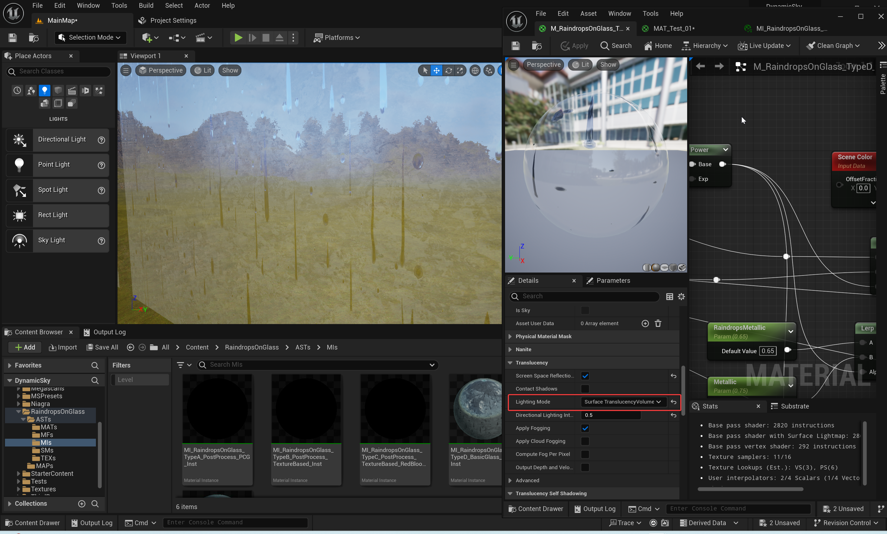

**Note:** There is a bug with the github DownloadZIP(".map" asset file are Git LFS file, Github DownloadZIP results in the ".map" file only 1KB).  **You should clone this repository by HTTPs or SSH of this git, Not by Github DownloadZIP.**

**Note:** Download the "**RaindropsOnGlass**" AssetPack from UE Marketplace, and copy it's "`\Content\RaindropsOnGlass`" into this Example Project "`\01_Codes\RaindropsOnGlassDemo\Content\RaindropsOnGlass`".

# Community Communication

**Add Discord.com Friend**: **YeHaike**

**DemoVideos**:

- **Video 01:** 
​		Youtube: https://youtu.be/D8t9vL-gMa4
​		Bilibili: https://www.bilibili.com/video/BV13C4y1Z74j
- **Video 02:** https://youtu.be/0vzOjzo6dVs

**Get this AssetPack from UE Marketplace:** https://www.unrealengine.com/marketplace/en-US/product/raindropsonglass-raindrops-effect-on-the-glass-or-the-camera-lens

# Introduce

## PRODUCT TITLE：

**RaindropsOnGlass: Raindrops Effect on the Glass or the Camera Lens** 

**UE Marketplace AssetPack**: https://www.unrealengine.com/marketplace/en-US/product/raindropsonglass-raindrops-effect-on-the-glass-or-the-camera-lens

**Preview Video 01:** 

Youtube: https://youtu.be/D8t9vL-gMa4

Bilibili: https://www.bilibili.com/video/BV13C4y1Z74j

**Preview Video 02:** https://youtu.be/0vzOjzo6dVs

.png)

## SHORT DESCRIPTION：

This "**RaindropsOnGlass**" provides a simple way to create realistic raindrops effects in Unreal Engine, including static and rolling raindrops effect on character camera lens glass(Post Process Effect) and normal window glass(Normal Material Effect). Contains Post Process Effect and Glass Material Effect for simulating rolling rain droplets on glass. It is useful to a rainy day.

## LONG DESCRIPTION：

**UE Marketplace AssetPack**: https://www.unrealengine.com/marketplace/en-US/product/raindropsonglass-raindrops-effect-on-the-glass-or-the-camera-lens

**Preview Video 01:** 

Youtube: https://youtu.be/D8t9vL-gMa4

Bilibili: https://www.bilibili.com/video/BV13C4y1Z74j

**Preview Video 02:** https://youtu.be/0vzOjzo6dVs

**Documentation and Example Project:** https://github.com/YHK-UEPlugins-Public/017_RaindropsOnGlass_Public

This "**RaindropsOnGlass**" offers a simple and easy-to-use method for creating realistic raindrop effects in Unreal Engine games. 

Using advanced materials and shader techniques, this asset pack achieves a realistic raindrops effect, adding immersion and realism to your game scene. This asset pack includes static and rolling raindrops effect on character camera lens glass(Post Process Effect) and normal window glass(Normal Material Effect).

This "**RaindropsOnGlass**" provides a wealth of parameters and options that allow developers to customize the size, density, speed, and other attributes of raindrops as needed.

Contains Post Process Effect and Glass Material Effect for simulating rolling rain droplets on glass. It is useful to a rainy day.

**Features brief**:

- Realistic raindrop falling on glass effect
- Camera lens post-processing raindrop falling effect
- Glass raindrop falling effect
- Static raindrops and rolling raindrops
- No scene capture used
- High performance, suitable for real-time games
- Fully procedurally generated

# Issues Fixing

## 1. Raindrop Brightness Control: By default, the TypeD or TypeE glass raindrop material employs “Surface ForwardShading” LightMode, which can cause raindrops to appear darker in certain scenarios, such as scenes without lighting (e.g., Night scenes).

**Issue Description**: https://github.com/YHK-UEPlugins-Public/017_RaindropsOnGlass_Public/issues/1

**TypeD Material Instance**: '`/Game/RaindropsOnGlass/ASTs/MIs/MI_RaindropsOnGlass_TypeD_BasicGlass_PCG_Inst`'

### **Reason Analysis**:

"**LightMode**" is: “**Surface ForwardShading**”(DefaultValue)

In this lighting mode, when directional light shines from the front of the glass, the water droplets on the glass appear normal. However, when the directional light comes from behind the glass, the water droplets appear darker. You might try switching the glass material to a different lighting mode.

### Solutions: Recommend using "Solution 02".

#### **Solution 01**: To increase the brightness of raindrops and prevent them from appearing too dark, you can increase the “**RaindropsColorScale**” property value in the material. For instance, if the default value is “0.75,” you might try adjusting it to “4.0” or "6.0".

"RaindropsColorScale": 0.75(Default Value)

"RaindropsColorScale": 4.0

"RaindropsColorScale": 6.0

#### **Solution 02**: Change the "**LightMode**" of Material to "Surface TranslucencyVolume", and set the “**RaindropsColorScale**” property value in the material instance to "1.0" or "2.0". Appropriately adjust the value of the "**OpacityOverride(0-1)**" property in the Material Instance, such as lowering it to: "0.005".

**Step01**: Change the "**LightMode**" of Material to "**Surface TranslucencyVolume**"

**Step02**: Set the “**RaindropsColorScale**” property value in the material instance to "1.0" or "2.0".

**Step03**: Appropriately adjust the value of the "**OpacityOverride(0-1)**" property of Material Instance, such as lowering it to: "0.005".

**Result**:

<video src="README/00_Res/01_Images/LightModeIsSurfaceTranslucencyVolume.mp4"></video>
<video src='https://github.com/YHK-UEPlugins-Public/017_RaindropsOnGlass_Public/assets/10463421/2f31c441-6c11-4a8c-9a31-8903eaefbe3f' width=180/>

# GALLERY

.png)

.png)

.png)

.png)

.png)

.png)

.png)

.png)

.png)

.png)

.png)

.png)

.png)

.png)

.png)

.png)

.png)

.png)

